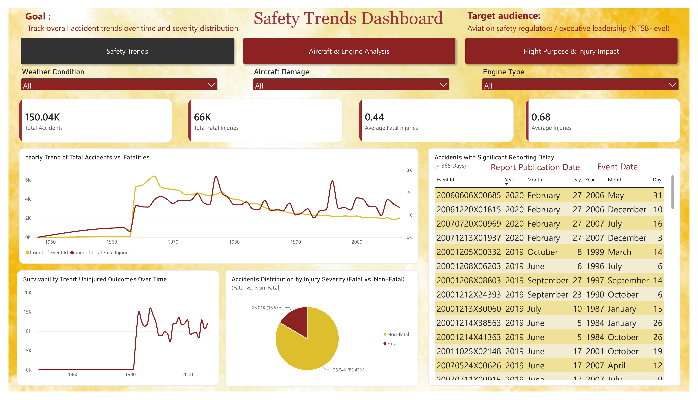
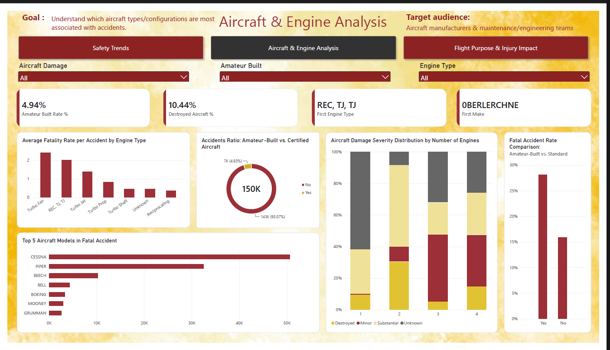
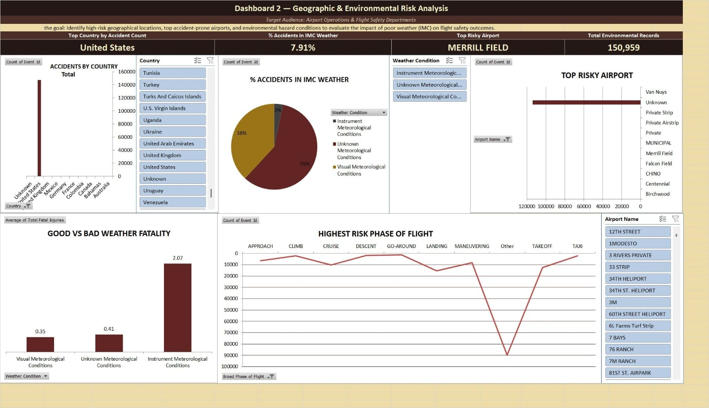
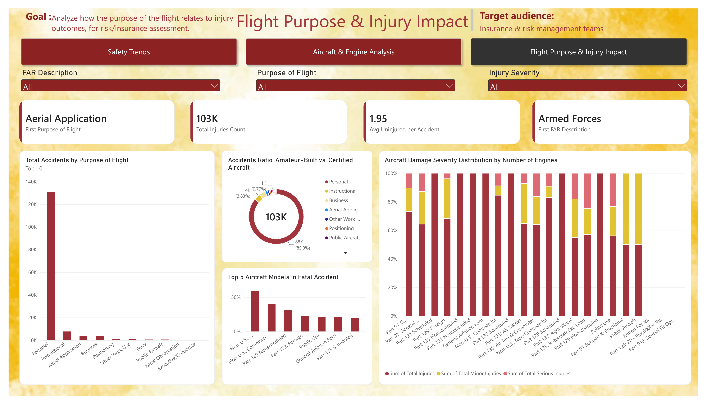

# Aviation Accidents & Incidents Analysis

### End-to-End Data Analysis Project

**Python | SQL Server | Power BI | Tableau**

---

## Project Overview

This project analyzes aviation accident and incident records to identify safety trends, accident severity patterns, geographic and environmental risks, aircraft and engine factors, and injury outcomes. The workflow transforms raw aviation data into decision-focused insights using Python, SQL Server, Power BI, and Tableau.

> **Independent academic project:** The logo and analysis were created for this project and do not represent an official aviation authority.

## Project Objectives

- Track accident and fatality trends over time.
- Compare fatal and non-fatal outcomes.
- Identify high-risk locations and weather conditions.
- Analyze aircraft manufacturers, models, and engine types.
- Compare amateur-built and certified aircraft.
- Study the relationship between flight purpose and injury severity.

## Tools and Technologies

| Tool | Main Use |
|---|---|
| Python | Cleaning, validation, feature engineering, and exploratory analysis |
| Pandas and NumPy | Data preparation and transformation |
| SQL Server | Business questions, aggregations, and structured analysis |
| Power BI | Interactive dashboards and KPI reporting |
| Tableau | Additional visualization and data storytelling |

## Data Preparation

- Loaded and explored the raw aviation records.
- Standardized column names and text values.
- Converted data types and treated missing values.
- Validated coordinates, injury counts, and engine values.
- Removed duplicate records.
- Created a **Total Injuries** feature.
- Reviewed outliers and prepared the cleaned dataset.
- Applied encoding and Min-Max normalization where required.

---

## Dashboard 1: Safety Trends Overview

**Goal:** Track accident volume, fatal injuries, survivability, severity distribution, and reporting delays.

### Main KPIs

- **Total Accidents:** 150.04K
- **Total Fatal Injuries:** 66K
- **Average Fatal Injuries:** 0.44
- **Average Injuries:** 0.68
- **Non-Fatal Records:** 83.43%
- **Fatal Records:** 16.57%

---

## Dashboard 2: Aircraft & Engine Analysis

**Goal:** Understand which aircraft types and configurations are most associated with accidents for aircraft manufacturers and maintenance or engineering teams.

### Main KPIs and Observations

- **Amateur-Built Rate:** 4.94%
- **Destroyed Aircraft Rate:** 10.44%
- Certified aircraft represent **95.07%** of the analyzed records.
- Cessna and Piper have the highest visible counts in the aircraft comparison.
- The dashboard compares fatality rates by engine type and aircraft damage by number of engines.

---

## Dashboard 3: Geographic & Environmental Risk

**Goal:** Identify accident concentration by location and examine the relationship between weather conditions and accident severity.

### Business Questions

1. Which countries and US states recorded the most accidents?
2. Which airports or locations had the highest accident frequency?
3. Which weather conditions were common in accident records?
4. How did weather relate to fatal and non-fatal outcomes?

---

## Dashboard 4: Flight Purpose & Injury Impact

**Goal:** Analyze how flight purpose and regulatory category relate to injury outcomes for insurance and risk assessment.

### Main KPIs

- **Total Injuries:** 103K
- **Average Uninjured per Accident:** 1.95
- Personal flights represent the largest visible flight-purpose category.

---

## Key Insights

- Most analyzed records were classified as non-fatal.
- Accident and fatality patterns changed substantially across the timeline.
- Geographic and weather analysis highlights areas requiring closer safety attention.
- Aircraft configuration and engine type provide useful engineering risk indicators.
- Flight purpose and regulatory category show different injury patterns.

## Team

- Abdelshakour Adel
- Osama Ahmed
- Mohammed Ihab
- Basmala Mahmoud
- Kirollos Godallah

### Supervisor

- Dr. Dina Mohsen

## Conclusion

This project demonstrates an end-to-end aviation accident analysis workflow, beginning with data preparation and ending with decision-focused dashboards. The results support a clearer understanding of accident patterns and potential operational, environmental, and engineering risk factors.
